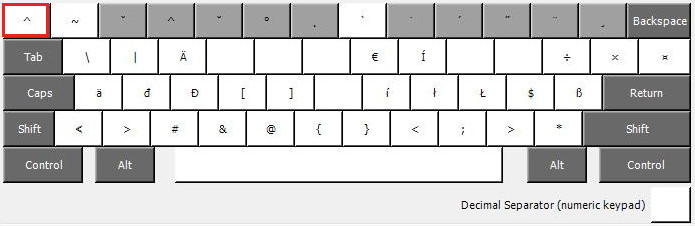

# HunLC Keyboard Layout

The HunLC Keyboard Layout is a Hungarian Keyboard Layout with a live
Caret key. It is a simple copy of the Hungarian Layout. The only
difference is an added Caret symbol, that is not a dead key.

One can type the Caret symbol on the Hungarian Keyboard Layout by
pressing the Caret dead key and then pressing space. But the Caret key
is part of shortcuts too. A good example is the M-^ shortcut in Emacs,
which invokes the “join line with previous” command, see:

[GNU Emacs Reference Card](https://www.gnu.org/software/emacs/refcards/pdf/refcard.pdf).

This shortcut is inaccessible in the original Hungarian Layout.

The HunLC Layout does not change the Hungarian layout, even the dead
Caret key stays where it originally is. We place the new "living" (or
undead) Caret key on Shift-0 and move the paragraph symbol to AltGr-0.

The Paragraph key is not on the US layout. National versions of
applications can use it, and they probably can handle the paragraph
key as a dead key as well.

The Caret key this way can stay a shifted key as in the US layout so
applications like Emacs can keep using it.

If we need a more thorough compatibility with applications designed
for the US layout like Emacs, then the best approach would be to
rearrange all letters back to how they are on the English layout and
move all accented Hungarian letters to dead keys. This makes typing
Hungarian text uncomfortable but keeps 100 percent compatibility with
the US layout based applications. We can use such a layout comfortably
by attaching and configuring an external smart keyboard (QMK, ZMK
firmware based keyboards). The HunLC layout is not that radical, it
only makes the often used Caret - often used by programmers at least -
more accessible.
