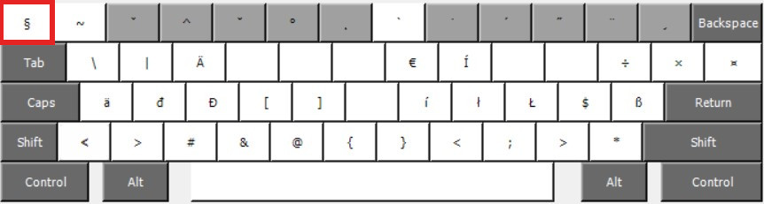

# HunLC Keyboard Layout

The HunLC Keyboard Layout is a Hungarian Keyboard Layout with a live
Caret key. It is a simple copy of the Hungarian Layout. The only
difference is an added Caret symbol, that is not a dead key.

One can type the Caret symbol on the Hungarian Keyboard Layout by
pressing the Caret dead key and then pressing space. But the Caret key
is part of shortcuts too. A good example is the M-^ shortcut in Emacs,
which invokes the “join line with previous” command, see:
[GNU Emacs Reference Card](https://www.gnu.org/software/emacs/refcards/pdf/refcard.pdf).
This shortcut is inaccessible in the original Hungarian Layout.

The HunLC Layout does not change the Hungarian layout, even the dead
Caret key stays where it originally is. The new “living” (or undead)
Caret key is in an unused location of the standard Hungarian Keyboard
Layout.

